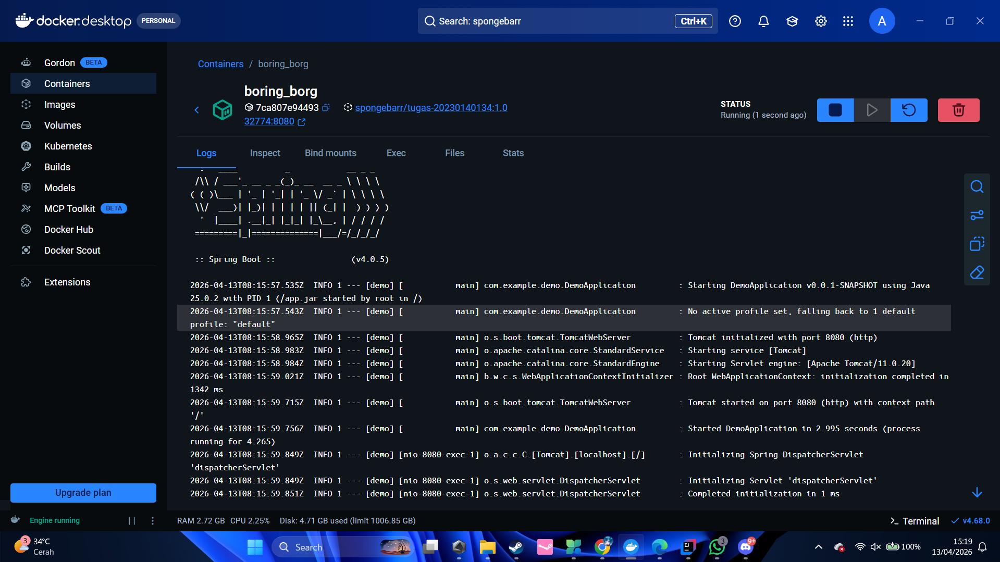
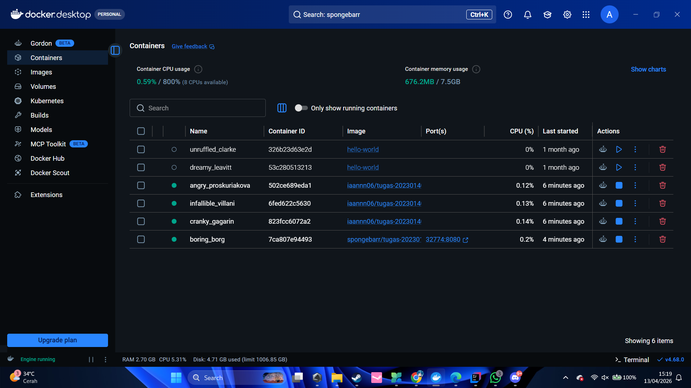
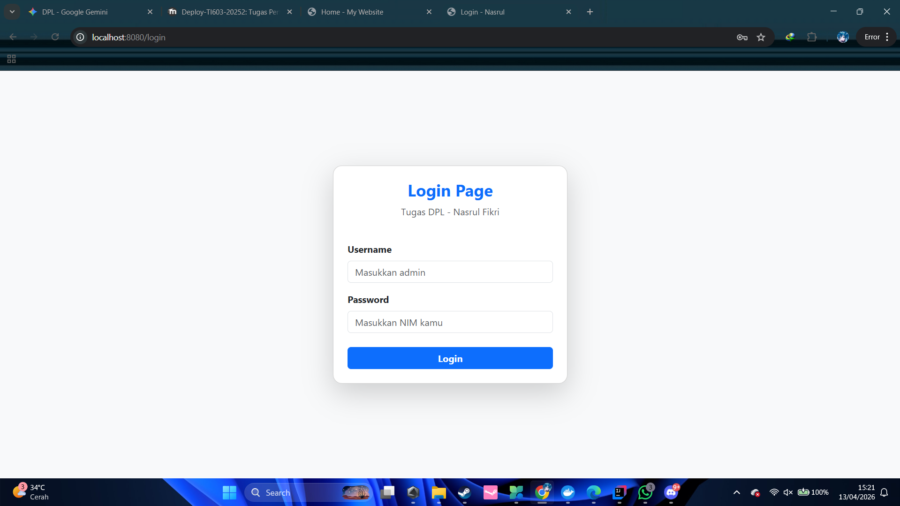
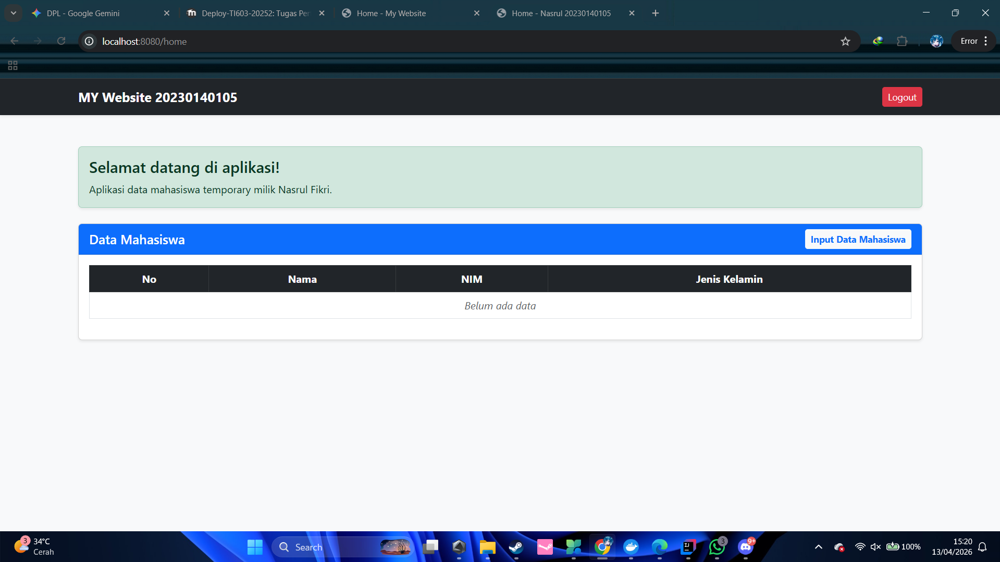
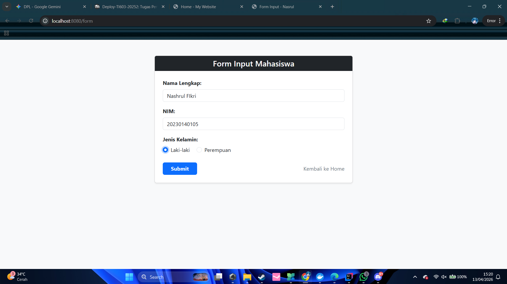
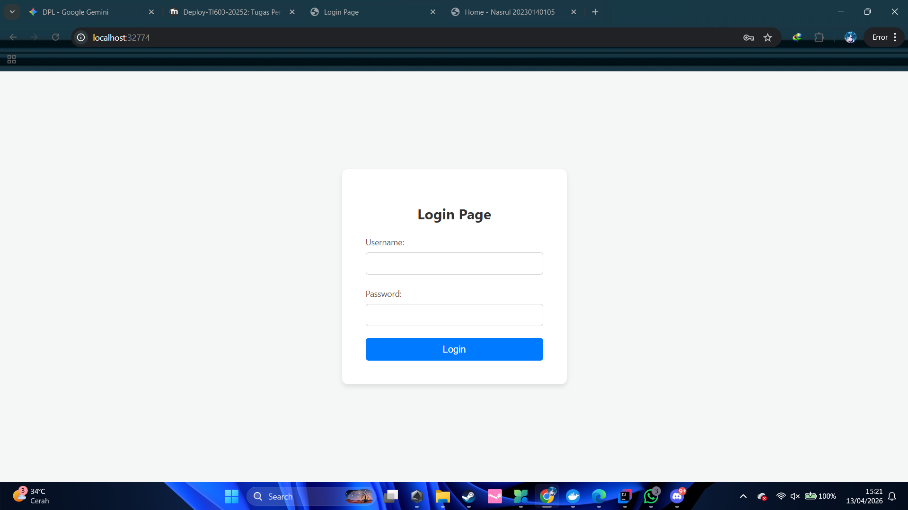
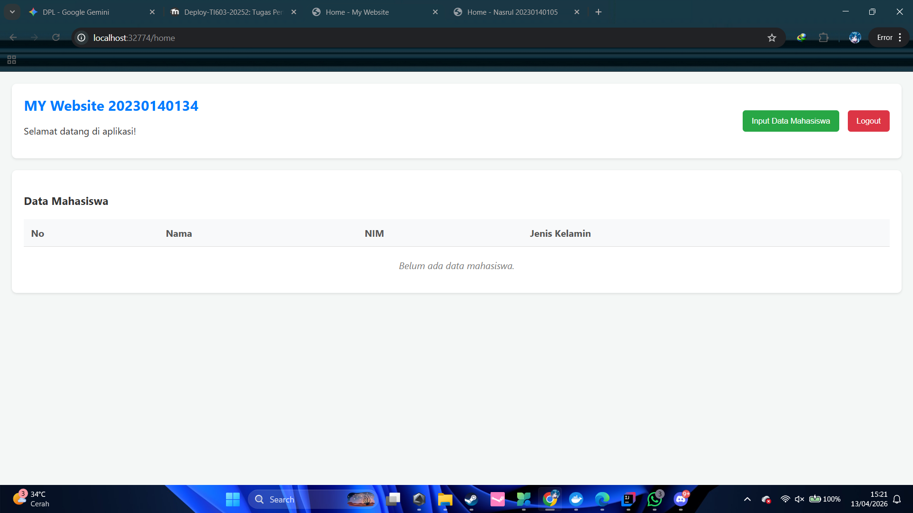
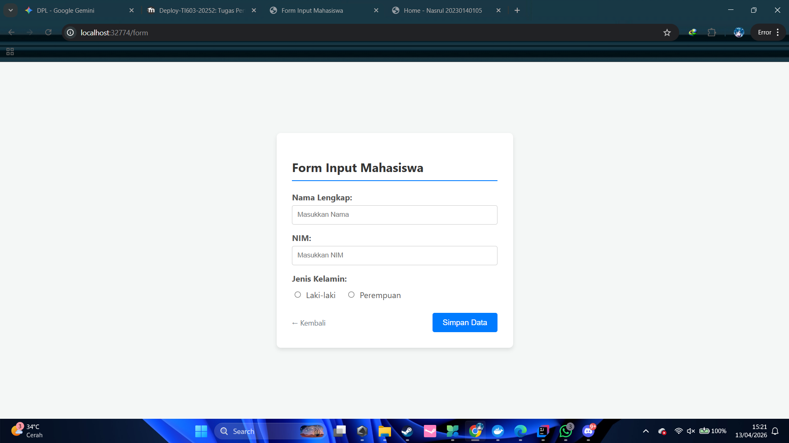
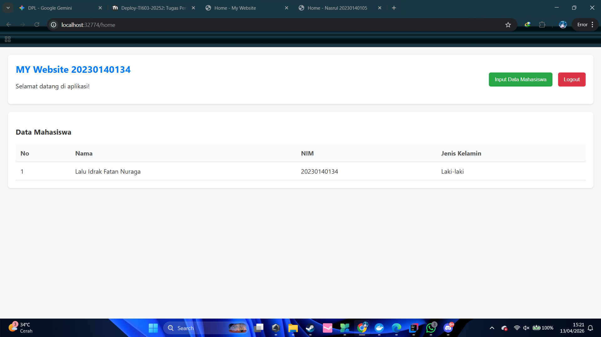

# Tugas Praktikum 6 - Deployment Perangkat Lunak (Dockerization)

## 👤 Identitas Mahasiswa
- **Nama:** Nashrul Fikri
- **NIM:** 20230140105
- **Prodi:** Teknologi Informasi
- **Instansi:** Universitas Muhammadiyah Yogyakarta

---

## 🛠️ Tech Stack & Docker Info
- **Backend:** Spring Boot 4.0.3 (Java 25)
- **Frontend:** Thymeleaf & Bootstrap 5
- **Docker Image:** `aestrick/tugas-20230140105:1.0`
- **Classmate Image Pulled:** `spongebarr/tugas-20230140134:1.0`

---

## 📸 Bukti Dokumentasi (10 Screenshots)

### 1. Docker Desktop Evidence
| No | Deskripsi                                                                          | Screenshot |
|----|------------------------------------------------------------------------------------|------------|
| 1 | **Halaman Images:** Hasil push image sendiri & pull image teman [cite: 690] |  |
| 2 | **Halaman Container:** Container dari image teman sedang berjalan [cite: 691]      |  |

### 2. Website Pribadi (Running via Docker)
| No | Deskripsi | Screenshot |
|----|-----------|------------|
| 3 | **Halaman Login:** Username: admin, PW: NIM [cite: 693] |  |
| 4 | **Halaman Home:** Tampilan awal (Data Kosong) [cite: 694] |  |
| 5 | **Halaman Form:** Input data mahasiswa baru [cite: 695] |  |
| 6 | **Halaman Home (Isi):** Tampilan setelah data di-input [cite: 696] |  |

### 3. Website Teman (Pulled Image)
| No | Deskripsi | Screenshot |
|----|-----------|------------|
| 7 | **Halaman Login Teman** [cite: 698] |  |
| 8 | **Halaman Home Teman (Kosong)** [cite: 699] |  |
| 9 | **Halaman Form Teman** [cite: 700] |  |
| 10 | **Halaman Home Teman (Isi)** [cite: 701] |  |

---

## 🚀 Cara Menjalankan Image Saya
Untuk menjalankan aplikasi ini, pastikan Docker sudah terpasang, lalu jalankan perintah:
```bash
docker pull aestrick/tugas-20230140105:1.0
docker run -d -p 8080:8080 aestrick/tugas-20230140105:1.0